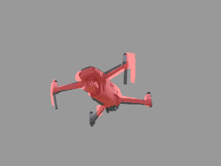
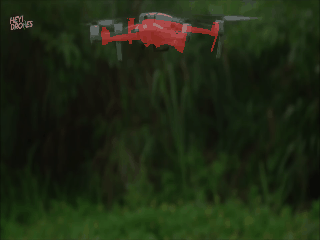
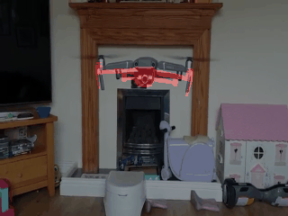
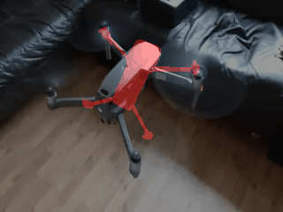
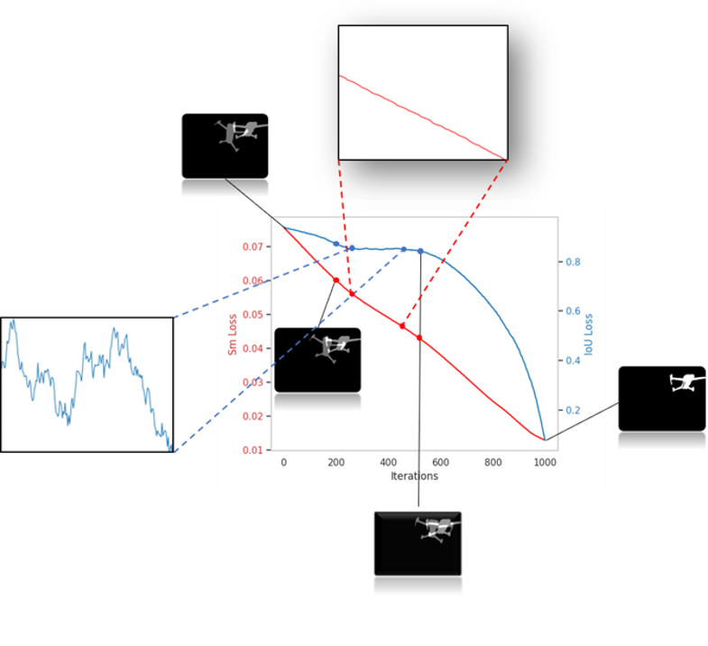
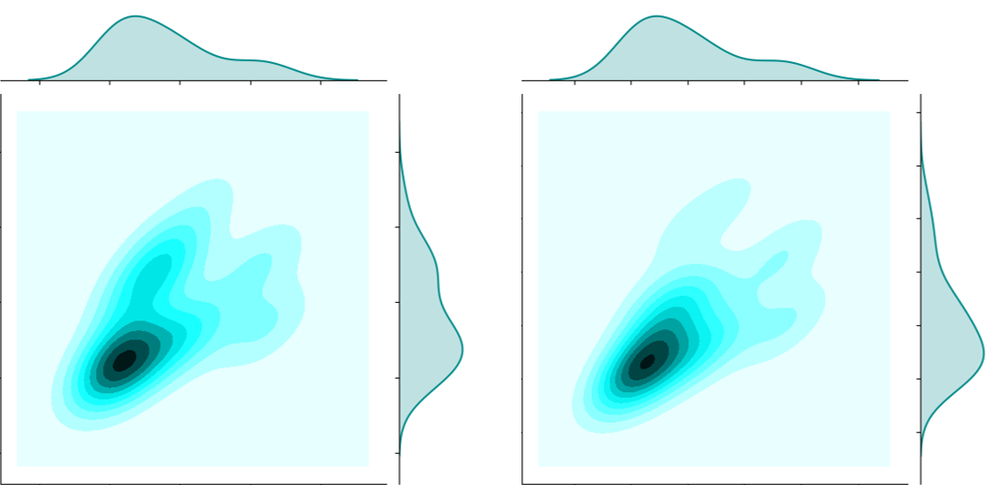
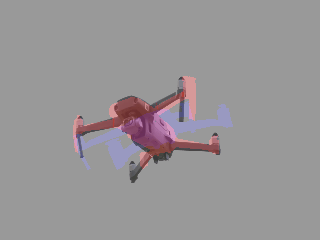

# Abstract
 In this work we consider UAVs as cooperative agents supporting human users in their operations. In this context, 
 the 3D localisation of the UAV assistant is an important task that can facilitate the exchange of spatial information between the user and the UAV. 
 To address this in a data-driven manner, we design a data synthesis pipeline to create a realistic multimodal dataset that includes both the exocentric user view,
 and the egocentric UAV view. We then exploit the joint availability of photorealistic and synthesized inputs to train a single-shot monocular pose estimation model.
 During training we leverage differentiable rendering to supplement a state-of-the-art direct regression objective with a novel smooth silhouette loss.
 Our results demonstrate its qualitative and quantitative performance gains over traditional silhouette objectives.

<h1 id="overview">Overview</h1>

<iframe width="560" height="315" src="https://www.youtube.com/embed/O7MKDN9Fwms" frameborder="0" allow="accelerometer; autoplay; encrypted-media; gyroscope; picture-in-picture" allowfullscreen></iframe>

 <h1> Code </h1>
 Our code and data will be available soon.

 <h1> Method </h1>
 A monocular sigle-shot pose estimation method enhanced with a differentiable renderer.
 

<h1> Results </h1>
Qualitative results in YouTube videos.
<table>
<tr>
<td>

</td>
</tr>
<tr>
<td>

</td>
</tr>
<tr>
<td>

</td>
</tr>
<tr>
<td>

</td>
</tr>
<tr>
<td>

</td>
</tr>
</table>
<h1> Loss Analysis </h1>
Apart from the quantitative improvement we further analyze the performance of our proposed smooth silhouette consistency loss function compared to the  typical IoU.
<h2> Interpolation </h2>
In our first experiment, we selected one random ground-truth pose and we interpolate between it with a random pose.
It can be seen that the proposed loss is more flat than the IoU.
<table>
<tr>
<td>

</td>
</tr>
<tr>
<td>

</td>
</tr>
</table>
<h2> Loss Landscape Analysis </h2>
Additionally, we provide a loss landscape analysis and 3D visualization of the loss surfaces.
The IoU has noticeable convexity in contrast to our proposed loss.
<table>
<tr>
<td>

</td>
</tr>
</table>
<h2> Loss distribution </h2>
Then, we present the distribution of the IoU loss compared to the smooth silhouette consistency one across a dense sampling of poses. 
The proposed loss is smoother and contains a better defined minima region.
<table>
<tr>
<td>

</td>
</tr>
</table>
<h2> Comparison in real data </h2>
Finally, we provide comparison results between a model trained with an IoU loss and another with our proposed smooth objective, in unseen real data. 
The smoothly supervised model minimizes inconsistencies in time and is more robust as it can be seen from the above video.
<table>
<tr>
<td>

</td>
</tr>
<tr>
<td>

</td>
</tr>
</table>
 <h1> Acknowledgements </h1>
 This project has received funding from the European Union’s Horizon 2020 innovation programme [FASTER](https://www.faster-project.eu/) under grant agreement No 833507.

{:width="150px"} {:width="150px"}
