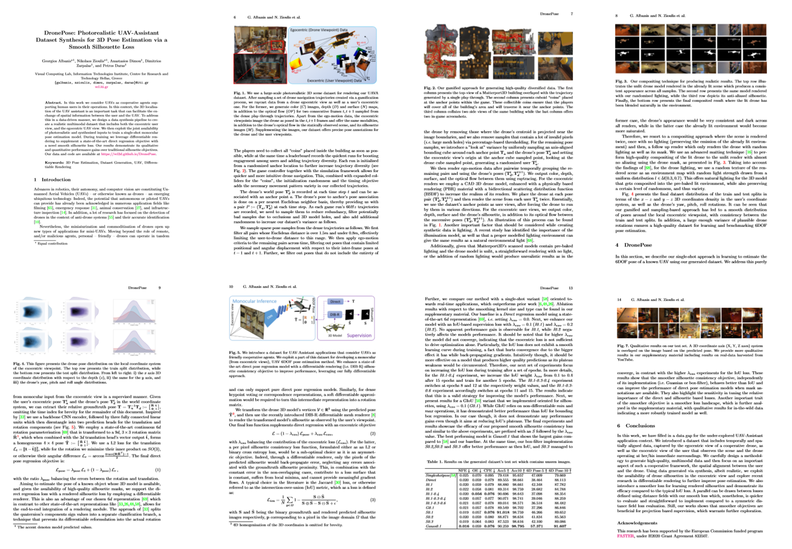

<h1 id="abstract">Abstract</h1>
 In this work we consider UAVs as cooperative agents supporting human users in their operations. In this context, 
 the 3D localisation of the UAV assistant is an important task that can facilitate the exchange of spatial information between the user and the UAV. 
 To address this in a data-driven manner, we design a data synthesis pipeline to create a realistic multimodal dataset that includes both the exocentric user view,
 and the egocentric UAV view. We then exploit the joint availability of photorealistic and synthesized inputs to train a single-shot monocular pose estimation model.
 During training we leverage differentiable rendering to supplement a state-of-the-art direct regression objective with a novel smooth silhouette loss.
 Our results demonstrate its qualitative and quantitative performance gains over traditional silhouette objectives.

<h1 id="overview">Overview</h1>

<iframe width="560" height="315" src="https://www.youtube.com/embed/dSbeu238I-I" frameborder="0" allow="accelerometer; autoplay; encrypted-media; gyroscope; picture-in-picture" allowfullscreen></iframe>

<h1>In-The-Wild (YouTube) Results</h1>
<table>
<tr>
<td>

</td>
<td>

</td>
</tr>
<tr>
<td>

</td>
<td>

</td>
</tr>
</table>
<h1> Loss Analysis </h1>
Our quantitative results demonstrate that the addition of a complementary silhouette-based supervision through a differentiable renderer, enhances overall performace.
Yet we also present an analysis with respect to the traditional IoU silhouette loss and our proposed smoother objective. 
Through the following multi-faceted analysis we conclude that the smoother loss variant exhibits more robust inference performance.
<h2> Loss Landscape </h2>
The following loss landscape analysis shows a 3D visualization of the loss surfaces from an IoU supervised model in comparison to the smooth silhouette loss.
The IoU trained model has noticeable convexity in contrast to our proposed smooth loss.
<table>
<tr>
<td>

</td>
</tr>
</table>
<h2> Loss Distribution </h2>
The following kernel density plots show the loss evaluations across a dense sampling of poses around the same rendered silhouette.
It illustrates how the proposed loss offers a smoother objective that contains a better defined minima region.
<table>
<tr>
<td>

</td>
</tr>
</table>
<h2> Pose Interpolation </h2>
In this experiment, an interpolation from a random pose towards the groundtruth pose is presented (_x-axis_), along with the sampled loss function value (_y-axis_).
The sensitivity of IoU is evident compared to the smoother behaviour of our proposed silhouette loss function.
<table>
<tr>
<td>

</td>
</tr>
<tr>
<td>

</td>
</tr>
</table>
<h2> Unseen Data Qualitative Performance </h2>
Finally, the following in-the-wild qualitative results, showcase that a model trained with the smoother objective (red overlay), offers consistent predictions across time compared to one trained with a typical IoU silhoutte loss (blue overlay). 
This qualitative comparison in unseen real data highlights the differences between these models, which nonetheless, provide similar quantitative performance on our test set. 
<table>
<tr>
<td>

</td>
<td>

</td>
</tr>
</table>

 <h1> Data </h1>
 
The data used to train our methods is a subset of the <a href="https://vcl3d.github.io/UAVA/">UAVA dataset</a>. 
Particularly, we used only the exocentric views that can be found in the following <a href="https://zenodo.org/record/3994337#.Xz_ruzVoSUk">Zenodo repository</a>.

The data can be downloaded following a two-step proccess as described in the corresponding UAVA dataset [page](https://vcl3d.github.io/UAVA/#Usage).

<h1> Publication </h1>

<p><a href="https://arxiv.org/pdf/2008.08823.pdf"></a></p>

<h2> Authors </h2>

<p><a href="https://github.com/tzole1155">Georgios Albanis</a> <strong>*</strong>, <a href="https://github.com/zokin">Nikolaos</a> <a href="https://github.com/zuru">Zioulis</a> <strong>*</strong>, <a href="https://www.iti.gr/iti/people/Anastasios_Dimou.html">Anastasios Dimou</a>, <a href="https://www.iti.gr/iti/people/Dimitrios_Zarpalas.html">Dimitrios Zarpalas</a>, and <a href="https://www.iti.gr/iti/people/Petros_Daras.html">Petros Daras</a></p>

<h2> Citation </h2>

```
@inproceedings{albanis2020dronepose,
  author       = "Albanis, Georgios and Zioulis, Nikolaos and Dimou, Anastasios and Zarpalas, Dimitris and Daras, Petros",
  title        = "DronePose: Photorealistic UAV-Assistant Dataset Synthesis for 3D Pose Estimation via a Smooth Silhouette Loss",
  booktitle    = "European Conference on Computer Vision Workshops (ECCVW)",
  month        = "August",
  year         = "2020"
}
```

<h1> Acknowledgements </h1>
This project has received funding from the European Union’s Horizon 2020 innovation programme [FASTER](https://www.faster-project.eu/) under grant agreement No 833507.

<table>
<tr>
<td>

</td>
<td>

</td>
</tr>
</table>

<!--{:width="150px"} {:width="150px"}-->
